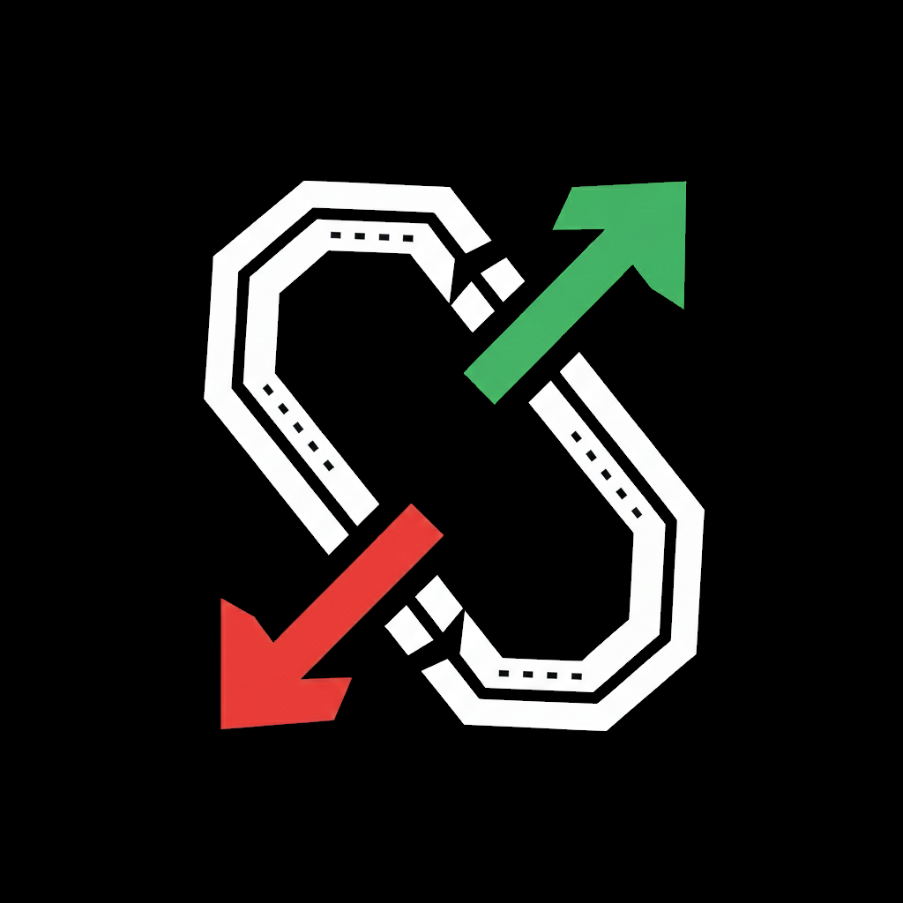
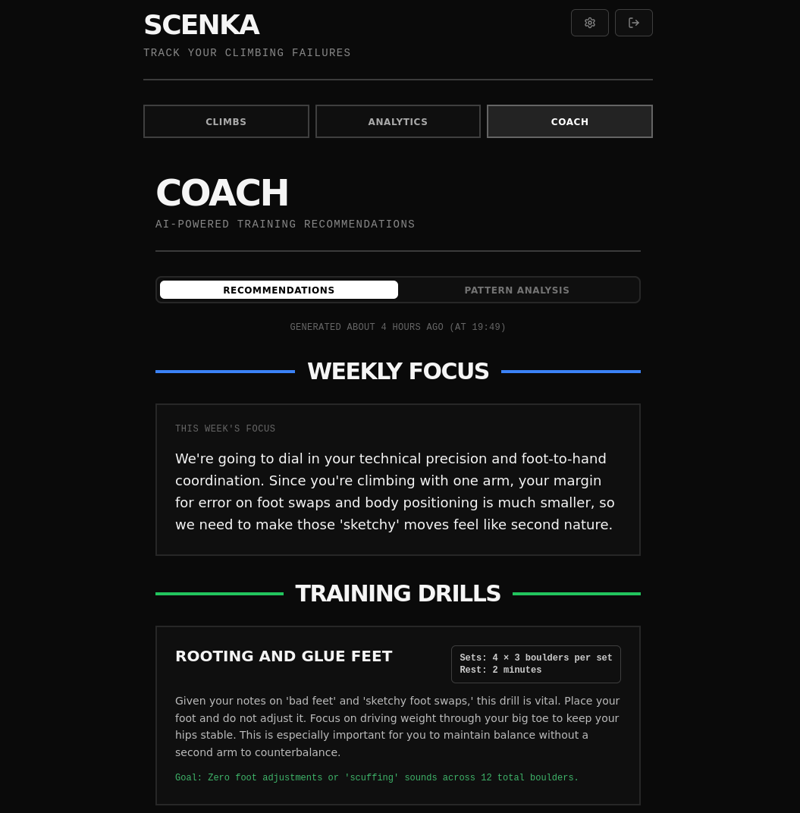
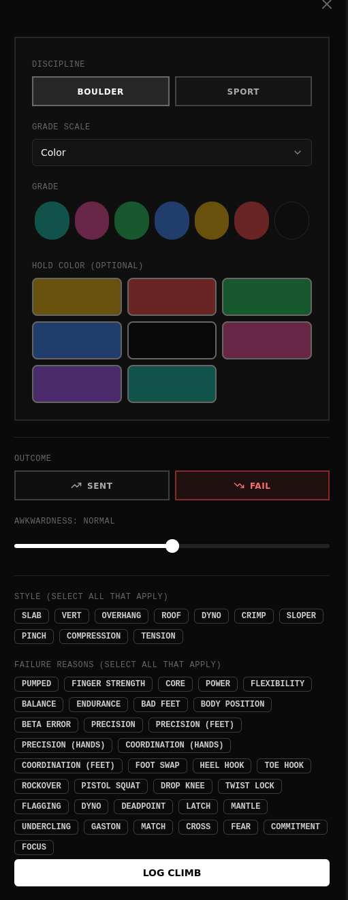
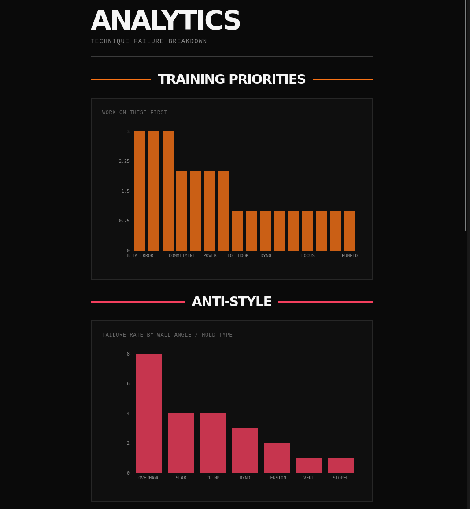
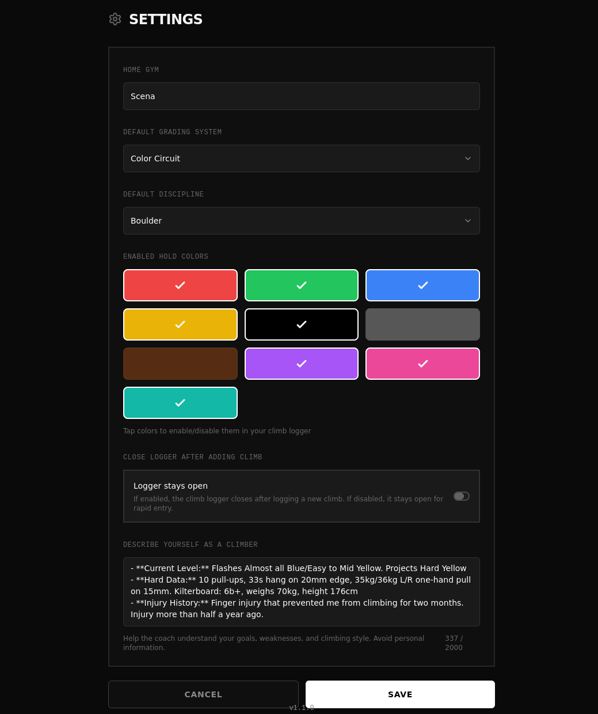
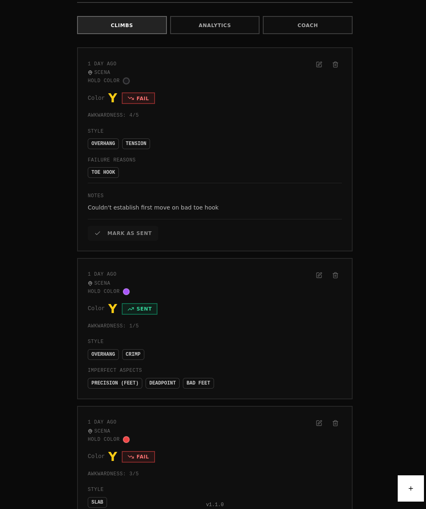

# Scenka



A personal climbing tracker built for climbers who want to get better, not just log sends. Exception logging, failure-focused, privacy-first, and offline-ready.

Vibe-coded for personal enjoyment — use if helpful, but no SLA!

## What Makes Scenka Different

Scenka follows an "exception logging" philosophy — only log significant climbs (failed projects, awkward sends) rather than every session. Less friction, more focus on what matters.

- **Failure-focused tracking** — Emphasize what went wrong (technique failures) vs just tracking sends 🧗
- **Multiple grading scales** — Font, V-Scale, Color Circuit
- **Detailed failure analysis** — Track style tags (Slab, Overhang, Dyno, etc.) and failure reasons (Physical, Technical, Mental)
- **Privacy-first** — No social feeds, no public profiles, your data stays yours 🔒
- **Offline-first PWA** — Works in gyms with zero signal, no app store required ⚡
- **Hold color tracking** — Mark climbs by hold color to easily find them again

## AI Coach (New in v2.0) 🧠

Scenka includes an AI-powered climbing coach that analyzes your logged data to provide personalized training guidance. Focuses on technique development with privacy-first design and climbing-specific domain knowledge.

**Features:**
- Weekly Focus: Personalized 1-2 sentence focus based on your failure patterns
- Training Drills: 3 specific technique drills with sets, reps, and measurable outcomes
- Pattern Analysis: Visual breakdown of failure reasons, style weaknesses, and climbing frequency
- Chat Interface: Free-form Q&A with streaming responses for deeper learning
- Projecting Focus: Suggestions for what to climb each week based on weaknesses
- Climbing Context: Customizable context (like ChatGPT custom instructions) for personalized coaching

### Privacy Safeguards

Your climbing data never leaves without anonymization:
- Gym names and crags anonymized before LLM processing (indoor_gym, outdoor_crags)
- Profile data (email, name) never included in LLM requests
- Row Level Security ensures users can only access their own recommendations
- Recent climb notes filtered for PII (>200 character threshold with runtime validation)
- All data sent to OpenRouter via secure Edge Functions (no client-side API calls)

### Setup Instructions

To enable AI Coach features, set up OpenRouter and deploy Edge Functions:

1. Get OpenRouter API key:
   - Sign up at [openrouter.ai](https://openrouter.ai)
   - Generate API key from dashboard

2. Set OpenRouter secrets in Supabase:
   ```bash
   supabase secrets set OPENROUTER_API_KEY=your_key_here
   supabase secrets set OPENROUTER_MODEL=google/gemini-2.5-pro
   ```

3. Deploy Edge Functions:
   ```bash
   supabase functions deploy openrouter-coach
   supabase functions deploy openrouter-chat
   ```

4. Apply database migrations (adds coach tables and climbing_context):
   ```bash
   npx supabase db push
   ```

### Usage

1. Log at least 3-5 climbs with detailed tags and failure reasons
2. Navigate to Coach tab
3. Click "Generate Recommendations" to get weekly focus, drills, and pattern analysis
4. Add climbing context in Settings (optional): Describe your climbing style, goals, preferences
5. Click "Ask Coach a Question" to chat about specific techniques, drills, or climbing concepts
6. Regenerate recommendations weekly for fresh analysis

<!-- TODO: Capture screenshot from app -->


*[Capture from: Navigate to Coach tab, showing Recommendations tab with Weekly Focus, Training Drills, Projecting Focus sections, and Pattern Analysis tab with failure patterns, style weaknesses, and climbing frequency]*

<!-- TODO: Capture screenshot from app -->


*[Capture from: Click "Ask Coach a Question" from coach page, showing chat interface with user/assistant message bubbles, streaming indicator, and text input]*

## Tech Stack

- **React 18** + **TypeScript** + **Vite** — Fast, type-safe frontend ⚛️
- **Supabase** — PostgreSQL database, authentication, and realtime sync
- **shadcn/ui** — Beautiful, accessible UI components
- **TanStack Query** — Server state management and caching
- **Zod** — Schema validation and type safety
- **react-hook-form** — Form state management
- **Recharts** — Data visualization for analytics 📊
- **PWA** — Service worker for offline capability

## Quick Start 🚀

```bash
# Install dependencies
pnpm install

# Start development server
pnpm dev

# Build for production
pnpm build

# Preview production build
pnpm preview
```

## Available Scripts ⚙️

- `pnpm dev` — Start Vite dev server
- `pnpm build` — Production build (includes TypeScript compilation)
- `pnpm preview` — Preview production build locally
- `pnpm lint` — ESLint check
- `pnpm format` — Prettier format
- `pnpm typecheck` — TypeScript type checking
- `pnpm test` — Run all tests

## Screenshots 📱

<!-- TODO: Capture screenshot from app -->


*[Capture from: Open the logger by clicking the + button, showing all form fields including grade scale, grade value, outcome (Sent/Fail), awkwardness slider, style tags multi-select, and failure reasons multi-select]*

<!-- TODO: Capture screenshot from app -->


*[Capture from: Navigate to Analytics tab, showing charts for failure reasons breakdown, grade distribution, and weekly activity]*

<!-- TODO: Capture screenshot from app -->


*[Capture from: Navigate to Settings, showing enabled hold colors section with toggle switches, grade scale dropdown, and other user preferences]*

<!-- TODO: Capture screenshot from app -->


*[Capture from: Main view showing list of logged climbs with grade, outcome, awkwardness, tags, and hold color indicators]*

<!-- TODO: Capture screenshot from app -->


*[Capture from: View on mobile device or browser DevTools mobile simulation, showing responsive layout and PWA full-screen experience]*

## Development Notes

### Code Style

- Functional components with hooks
- TypeScript strict mode (no `any` types)
- shadcn/ui patterns for UI components
- Zod validation for all forms
- TanStack Query for server state
- React Context for global app state

### Testing

Test coverage focused on business logic in `/lib` and `/services`:

```bash
# Run all tests
pnpm test

# Run specific test file
pnpm vitest run <path-to-test-file>

# Run specific test by name
pnpm vitest run <path-to-test-file> -t "<test-name>"
```

### Grading Systems

- **Font**: 3-9c (European system)
- **V-Scale**: VB-V17 (Hueco scale)
- **Color Circuit**: Teal → Black (gym-specific colors)

### Tags

**Style:** Slab, Vert, Overhang, Roof, Dyno, Crimp, Sloper, Pinch

**Failure Reasons:**
- Physical: Pumped, Finger Strength, Core, Power
- Technical: Bad Feet, Body Position, Beta Error, Precision
- Mental: Fear, Commitment, Focus

### Awkwardness Scale

1 = Flow state, 5 = Sketchy/desperate

## Project Status

This is a personal project built for my own climbing journey. It's actively maintained and may be shared with friends, but it's not designed for public release as a commercial product.

**What this means:**
- Features are driven by my personal needs
- No external support or guarantees
- Code quality is important, but shipping fast is prioritized
- Feel free to use it as inspiration or run it locally if it helps you!

---

Built with love and frustration at the climbing gym.
